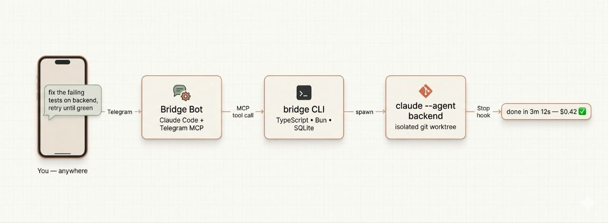

# Claude Bridge

> **Get the most out of Claude Code.** A thin orchestrator that wires up Claude Code's native primitives — agents, session continuity, worktree isolation, Auto Memory, Stop hooks — into the workflows you actually want: per-project skills, goal loops, schedules, and remote control over chat.

[](https://bun.sh)
[](https://www.typescriptlang.org/)
[](https://docs.anthropic.com/en/docs/claude-code)
[](#license)
[](#development)

Claude Code already ships with everything you need: `--agent` for scoped behavior, `--session-id` for continuity, `isolation: worktree` for safe concurrency, Auto Memory for persistent context, Stop hooks for completion signals, prompt caching for cost. Each one is powerful on its own. Wiring them together by hand — every time, for every project — is tedious.

**Claude Bridge is the wiring.** It turns those primitives into ready-to-use workflows: a project-scoped skill is one command, a goal loop is one chat message, a schedule is one sentence. And once it's running, you drive everything from a chat client (Telegram today, Discord/Slack soon) instead of being chained to a terminal.



---

## What you actually get

Each row is a Claude Code primitive Bridge composes into a higher-level workflow.

| Workflow | Claude Code primitive used | What Bridge adds |
|---|---|---|
| **Project skill** — one agent per repo, with its own model, memory, tools, and worktree | `--agent` + `isolation: worktree` + `memory: enabled` + Stop hook | One-line creation, persistent across reboots, drivable by name from chat |
| **Goal loop** — *"retry until tests pass"* | Per-iteration Claude Code invocation under the same agent, deterministic `--session-id` per task, Stop hook | Done-condition evaluator (command / file_exists / file_contains / llm_judge / manual), cost ceilings, max-iterations, give-up on consecutive failures |
| **Scheduled task** — *"every hour, do X"* | Same task dispatch primitive | Interval scheduler with exponential backoff, pause/resume from chat |
| **Remote session** | MCP server + the bot's own Claude Code session connecting to it | Telegram channel adapter, push notifications, permission-relay DMs |
| **Cost & memory inspection** | `--output-format json` (`total_cost_usd`) + Auto Memory files | Aggregated views per agent / per loop / per period, queryable from chat |
| **Auto-init CLAUDE.md** *(roadmap — function landed, not yet exposed)* | `claude -p` with an analysis prompt | CLI command and MCP tool wiring planned |

---

## How Bridge composes Claude Code

**1. Project skills** — `--agent` + `isolation: worktree` + Auto Memory, packaged

Claude Code's `--agent` flag loads a YAML-fronted markdown file that scopes purpose, model, allowed tools, and isolation. Add `memory: enabled: true` and you get persistent Auto Memory. Bridge writes that agent file for you (`{bot_dir}/.claude/agents/bridge--{name}.md`) with `isolation: type: worktree` and memory enabled, plus a companion entry in `.claude/settings.local.json` that registers the Stop hook (the agent frontmatter alone won't trigger it — it has to live in settings). Result: one named, reusable skill bound to one project, callable from chat by name.

> *"backend is for my API at ~/projects/my-api, sonnet, focused on REST work"* — Bridge writes the agent file, the worktree directive, the memory flag, and the Stop hook entry in settings.

**2. Auto-init CLAUDE.md** — coming soon, function landed

The generator (`src/cli/claude-md.ts`) is implemented and runs `claude -p` with an analysis prompt to produce a CLAUDE.md for any codebase. **It is not yet exposed as a CLI command or MCP tool**, so you can't trigger it from chat today. Wiring is on the [roadmap](#roadmap).

**3. Goal loops** — same agent, fresh Claude Code invocation per iteration, Stop hook-driven

Each iteration is a separate Claude Code invocation under the same agent (so prompt caching hits — the system prompt and tool definitions don't churn). Iterations get a deterministic per-task `--session-id` (a UUID hashed from `sessionId:taskId`) so they're independent conversations, but they share Auto Memory and the loop orchestrator threads context forward between them. The Stop hook reports completion; Bridge's `LoopEvaluator` then checks the done-condition and either advances or stops. Five condition types:
- A command exits 0 (*"until `bun test` passes"*)
- A file exists, or contains a string
- An LLM judge approves the work
- You personally approve, in chat
- With cost ceilings, max iterations, and graceful give-up after consecutive failures.

**4. Schedules** — the same dispatch path, on a timer

A scheduled task is a normal Claude Code dispatch fired on an interval. Bridge adds the scheduler, exponential backoff on failures (2× per error, capped at 8×), and pause/resume from chat. (The schema also has a `cron_expr` column and a `MAX_CONSECUTIVE_ERRORS = 5` constant — full cron and auto-disable are wired in the data model but not yet enforced by the runner; tracked on the [roadmap](#roadmap).)

> *"Every hour, sweep linter warnings."* *"Every morning, generate the market brief."*

**5. Remote sessions** — Bridge as MCP server, the bot as a Claude Code client

Bridge runs an MCP server (`src/mcp/server.ts`). Your bridge-bot directory contains a Claude Code session whose `.mcp.json` connects to that server, so the bot can call `bridge_dispatch`, `bridge_status`, `bridge_loop`, etc. as tools. Channel adapters (Telegram live; Discord/Slack stubbed) poll incoming messages, hand them to the bot session, and a notification loop drains task-completion events back to the channel. Approve risky tool calls in a DM (permission relay), get pinged when work lands, check status from your phone.

**The operational glue that makes it production-ready**
- Cost tracking from Claude Code's own `--output-format json` (`total_cost_usd` per invocation), aggregated by agent, loop, and time window.
- Concurrent tasks per agent queue automatically — atomic check-and-create returns `isBusy`, queued tasks dequeue when the Stop hook fires.
- Multi-instance via `CLAUDE_BRIDGE_HOME` — one `work` bot, one `personal` bot, separate DB, separate token.
- Self-diagnosing health checks (`bridge doctor`).
- Survives reboots — installs as launchd plist (macOS) or systemd user unit (Linux).

---

## 60-second tour

**One-time setup, on your laptop:**

```bash
# 1. Install
git clone https://github.com/hieutrtr/claude-bridge.git
cd claude-bridge && bun install && bun link

# 2. Scaffold a bot project (interactive — prompts for Telegram token)
bridge setup-bot ~/projects/bridge-bot

# 3. Install the daemon and start it
bridge install --auto-start
```

**Everything else, from your phone:**

> **You:** create an agent called `backend` for `~/projects/my-api`, it's for API development, use sonnet
>
> **Bot:** Done. `backend` is ready.
>
> **You:** backend, add pagination to `/users`
>
> **Bot:** Dispatched. I'll ping you when it's done.

That's the whole loop. Setup once on the laptop, drive forever from chat.

---

## How it works

```
  Telegram user
       │
       ▼
  Bridge Bot            <-- Claude Code session with Telegram MCP
       │                    (parses intent, calls MCP tools)
       │  bridge_dispatch(agent, prompt)
       ▼
  bridge (CLI)          <-- TypeScript CLI + MCP server
       │
       ▼
  claude --agent <bridge--agent> --session-id <uuid> -p "<task>"
       │
       ▼  (Stop hook fires on exit)
  bridge on-complete --session-id ...
       │
       ▼
  SQLite updated --> Notifier --> Telegram
```

- Tasks spawn via `Bun.spawn` with a detached process group. Completion is detected by the **Stop hook**, with a 30 s `ProcessWatcher` fallback for missed hooks and a 6 h timeout ceiling.
- All state lives in SQLite (`bridge.db` for tasks/agents/loops/schedules, `messages.db` for channel I/O), with WAL so the stop hook and the long-lived bridge process share the database safely.
- The MCP server (`src/mcp/server.ts`) is what Claude Code talks to; `StartupOrchestrator` boots the watcher, the 5 s notification delivery loop, and the scheduler alongside it.

---

## Requirements

- [Bun](https://bun.sh) — runtime, package manager, test runner.
- [Claude Code CLI](https://docs.anthropic.com/en/docs/claude-code) — `claude` on `PATH`.
- macOS (launchd) or Linux (systemd user unit) for daemon mode.
- A Telegram bot token from [@BotFather](https://t.me/BotFather) for the Telegram channel.
- `tmux` if you skip the daemon and use the fallback persistent session.

---

## Installation

```bash
git clone https://github.com/hieutrtr/claude-bridge.git
cd claude-bridge
bun install
bun link             # makes `bridge` available on PATH
bun run build        # bundles src/index.ts to dist/index.js
```

Run directly from source without linking:

```bash
bun run src/cli/index.ts <command>
```

### Daemon mode (recommended for production)

```bash
bridge install --auto-start   # launchd (macOS) or systemd user unit (Linux)
bridge daemon-status          # platform, daemon state, session pid/uptime, log
bridge uninstall              # remove the daemon
```

With a daemon installed, `bridge start / stop / restart` drive the OS service. Without one, they fall back to a managed tmux session.

---

## Setup

Claude Bridge needs a home directory (`~/.claude-bridge` by default, or `$CLAUDE_BRIDGE_HOME`) and a bridge-bot project containing `CLAUDE.md`, `.mcp.json`, and `.claude/agents/`. `bridge setup-bot` scaffolds it all and writes `config.json`.

```bash
# Interactive — prompts for a Telegram bot token (Enter to skip)
bridge setup-bot ~/projects/bridge-bot

# Non-interactive
bridge setup-bot ~/projects/bridge-bot \
    --telegram-token "123456:ABC-your-bot-token" \
    --no-prompt
```

| Flag | Purpose |
|---|---|
| `--telegram-token TOKEN` | Store the token in `~/.claude-bridge/config.json` |
| `--no-prompt` | Never read from stdin; fail if values are missing |
| `--force` | Overwrite a non-empty bot directory |

If you ran `bridge install --auto-start` above, the bot is already running. Open Telegram, message your bot, and you're in. Otherwise: `bridge start`.

> **Upgrading?** The Stop hook command changed from `bridge-cli on-complete` to `bridge on-complete`. Regenerate existing agents from chat (*"delete agent backend, then recreate it for ~/projects/my-api"*). If `bridge daemon-status` shows the plist points at an old `bot_dir`, run `bridge uninstall && bridge install` to regenerate.

---

## Talk to it like a person

Once the bot is paired with your Telegram chat, you just message it. The bot's `CLAUDE.md` routes plain English (or Vietnamese, or whatever) to the right tool — no flags, no syntax to memorize.

### Onboard a new project

> **You:** create a skill called `checkout` for `~/projects/checkout-api` — focused on payments work, use sonnet.
>
> **Bot:** ✅ Created skill `checkout` bound to `~/projects/checkout-api`, sonnet, purpose "payments work". Worktree isolation and Auto Memory are on. Ready to dispatch.

### Dispatch a task

> **You:** add pagination to `/users` on backend
>
> **Bot:** Dispatched to `backend`. I'll ping you when it's done.
>
> *(3 minutes later)*
>
> **Bot:** ✅ `backend` finished — added cursor pagination to `/users`, $0.18.

Other things that work:
- *"backend, refactor the auth module"*
- *"kill whatever backend is doing right now"*
- *"what's backend been up to today?"* — pulls history with costs
- *"how much have I spent this week?"*

### Run until it works (loops)

> **You:** keep fixing the failing tests on backend until they all pass, give up after 5 tries
>
> **Bot:** Loop started (`abc12345`). Iteration 1 running…

The bot translates "until they all pass" into the right done-condition. Other phrasings it understands:

- *"draft the morning market brief on vn-trader, stop when `output/morning-brief.md` exists"*
- *"refactor the auth module on backend to production quality — tests, errors, docs — max $5"*
- *"polish the API spec but check with me before continuing each round"* (human-in-the-loop)

Cancel, approve, or course-correct the same way:

> **You:** cancel loop abc12345
>
> **You:** loop abc12345 is still failing in module X — try again with that feedback

### Schedule recurring work

> **You:** every hour, have backend sweep linter warnings — call it `nightly-lint`
>
> **Bot:** Scheduled. Next run in 60 minutes.
>
> **You:** pause nightly-lint
>
> **You:** show me what's scheduled

### Approve tool calls from chat

When an agent wants to run something risky (rm, push, network call), the bot DMs you:

> **Bot:** `backend` wants to run `rm -rf node_modules`. Approve?
>
> **You:** yes

Default 5-minute timeout, denies on no answer.

### Just check in

- *"status"* — what's running, what's queued
- *"agents"* — list all of them
- *"what does backend remember about this project?"* — dumps Auto Memory

---

## CLI reference (for power users)

Everything the bot does is a thin layer over `bridge` commands. Useful when you want to script, run from another shell, or debug.

<details>
<summary><b>Agent management</b></summary>

```bash
bridge create-agent backend ~/projects/my-api --purpose "API development" --model sonnet
bridge list-agents
bridge status                 # global: agents + running tasks
bridge status backend         # single agent detail
bridge set-model backend opus
bridge delete-agent backend
```
</details>

<details>
<summary><b>Tasks</b></summary>

```bash
bridge dispatch backend "add pagination to /users"
bridge history backend --limit 20
bridge cost                   # all agents, all time
bridge cost backend --period week
bridge kill backend           # SIGTERM -> SIGKILL the running task
bridge memory backend         # dump Auto Memory for this project
```
</details>

<details>
<summary><b>Loops</b></summary>

Done-condition prefixes: `command:`, `file_exists:`, `file_contains:`, `llm_judge:`, `manual:`.

```bash
bridge loop backend "Fix all failing tests" \
    --done-when "command:bun test" --max 5

bridge loop vn-trader "Generate morning market brief" \
    --done-when "file_exists:output/morning-brief.md"

bridge loop backend "Refactor auth module to production quality" \
    --done-when "llm_judge:Code has tests, error handling, and docs" \
    --max 8 --type bridge --max-cost 5.00

bridge loop backend "Draft API spec" --done-when "manual:review before continuing"

bridge loop-list --active
bridge loop-status --loop-id abc12345
bridge loop-history abc12345
bridge loop-cancel abc12345
bridge loop-approve abc12345
bridge loop-reject abc12345 --feedback "still failing in module X"
```
</details>

<details>
<summary><b>Schedules</b></summary>

```bash
bridge schedule-add backend "Sweep linter warnings" --every 60 --name nightly-lint
bridge schedule-list
bridge schedule-list --agent backend --all
bridge schedule-pause nightly-lint
bridge schedule-resume nightly-lint
bridge schedule-remove nightly-lint
```
</details>

<details>
<summary><b>Lifecycle & diagnostics</b></summary>

| Command | Purpose |
|---|---|
| `bridge setup-bot <dir>` | Scaffold the bot directory (CLAUDE.md, .mcp.json, agents dir) |
| `bridge start` / `stop` / `restart` | Drive the daemon (or tmux fallback) |
| `bridge install [--auto-start]` | Install launchd plist or systemd user unit |
| `bridge uninstall` | Uninstall the daemon |
| `bridge attach` | Attach to the running bot tmux session (Ctrl-b d to detach) |
| `bridge daemon-status` | Platform, daemon installed/running, session PID, uptime, log |
| `bridge doctor` | Diagnose setup with `[ok] / [warn] / [fail]` checks |
| `bridge logs [--tail N] [-f]` | Tail `~/.claude-bridge/bridge.log` |
</details>

<details>
<summary><b>MCP tools (24 total)</b></summary>

The bot calls these on your behalf. The full registry lives in `TOOL_NAMES` / `TOOL_DEFINITIONS` in `src/mcp/tools.ts`.

| Tool | Purpose |
|---|---|
| `bridge_dispatch` | Send a task to an agent |
| `bridge_status` | Running tasks, optionally filtered by agent |
| `bridge_agents` | List all registered agents |
| `bridge_history` | Per-agent task history with costs |
| `bridge_kill` | Kill the running task on an agent |
| `bridge_loop` | Start a goal loop |
| `bridge_loop_status` | Inspect loop progress |
| `bridge_schedule_add` | Register a recurring task |
| `bridge_reply` | Post a message back to the user |
| `bridge_get_notifications` | Drain pending task-completion notifications |
</details>

<details>
<summary><b>Stop hook (internal)</b></summary>

```bash
bridge on-complete --session-id backend--my-api
```

Wired into each agent's `.claude/settings.local.json` automatically by `cli/agent-md.ts` — you do not invoke it by hand. It updates the task row, enqueues a notification, and auto-dequeues the next queued task for the same session.
</details>

---

## Multi-instance

Want a `work` bot and a `personal` bot living side-by-side, with separate agents and separate Telegram tokens? Each instance is isolated by `CLAUDE_BRIDGE_HOME` — its own database, config, workspaces, and daemon service name.

One-time setup for the second instance, on your laptop:

```bash
CLAUDE_BRIDGE_HOME=~/.claude-bridge-personal bridge setup-bot ~/projects/bridge-bot-personal
CLAUDE_BRIDGE_HOME=~/.claude-bridge-personal bridge install --auto-start
```

After that, both bots run independently. Just chat with each one separately — they don't share state.

Give each instance its own Telegram bot token so the pollers don't race, and use distinct agent names so the generated agent files don't collide.

---

## Project structure

```
src/
  cli/             bridge dispatcher (index.ts), setup-bot, agent-md generator, Auto Memory reader
  data/            SQLite stores, SessionManager, interfaces
  execution/       Dispatcher, CompletionHandler, ProcessWatcher, Notifier
  orchestration/   LoopOrchestrator, LoopEvaluator, Scheduler
  mcp/             MCP server, tool registry, native tool handlers
  infra/           StartupOrchestrator, daemon (launchd/systemd), tmux helpers, permission relay
  channel/         Telegram (formatter live), Discord/Slack (stubs)
  config.ts        CLAUDE_BRIDGE_HOME resolution, config.json loader
  types.ts         Domain model (Agent, Task, Loop, Schedule, ...)
  index.ts         Public API barrel

tests/             Bun test suite (wave1/ ... wave7/ + coverage/)
docs/              Deep docs (see ARCHITECTURE.md); pre-1.0 design notes under docs/archive/
specs/             Task specifications
```

---

## Development

```bash
bun install
bun test                            # full suite
bun test tests/wave1                # single directory
bun run typecheck                   # tsc --noEmit
bun run build                       # bundle to dist/index.js
```

For the layer-by-layer architecture, data model, runtime flows (dispatch, stop hook, loop iteration, schedule tick, MCP call, startup), and extension points, see [`docs/ARCHITECTURE.md`](docs/ARCHITECTURE.md).

---

## Roadmap

- [x] Project skills — per-project agents with model, memory, hooks, isolated worktree
- [x] Goal loops with 5 condition types (command / file / LLM judge / manual / contains)
- [x] Recurring schedules with backoff
- [x] Telegram remote channel
- [x] Permission relay over chat
- [x] Multi-instance isolation
- [ ] CLAUDE.md auto-init from chat (generator landed in `src/cli/claude-md.ts`; CLI command + MCP tool not wired)
- [ ] Schedule auto-disable after `MAX_CONSECUTIVE_ERRORS` (constant set, runner doesn't enforce)
- [ ] `cron_expr` schedules (column exists; runner currently uses `interval_minutes`)
- [ ] Discord channel (adapter stub landed)
- [ ] Slack channel (adapter stub landed)
- [ ] Skill marketplace — share project agent templates across teams

---

## License

MIT — see `package.json`. A standalone `LICENSE` file has not been added yet.
